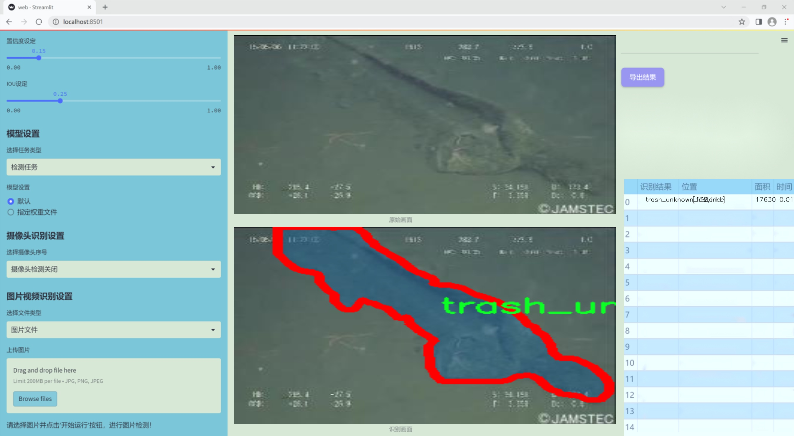
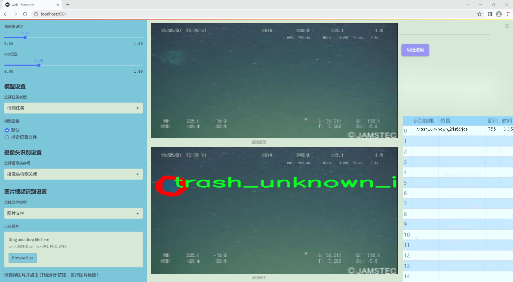
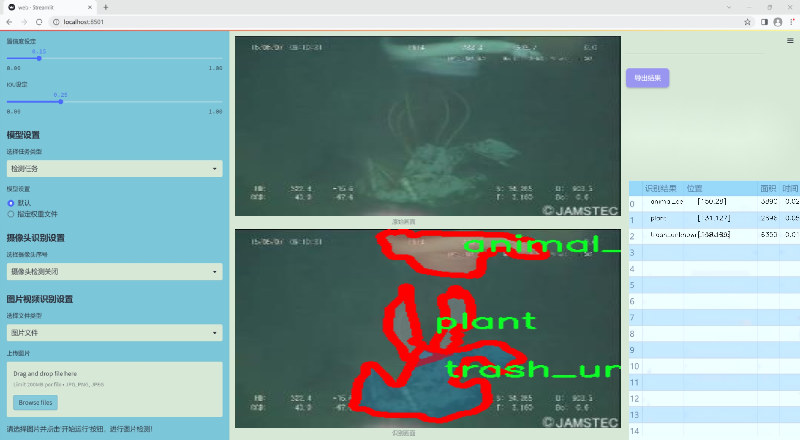
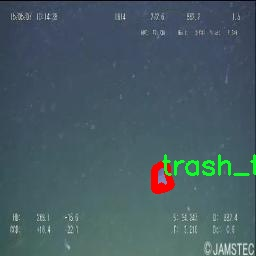
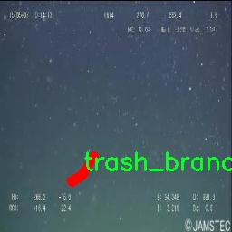
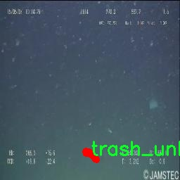
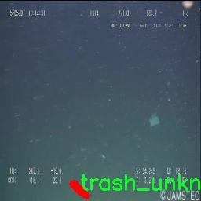
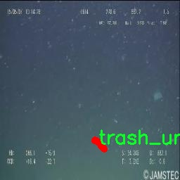

### 1.背景意义

研究背景与意义

随着全球经济的快速发展和人口的持续增长，海洋环境面临着前所未有的压力，尤其是海洋垃圾问题日益严重。根据联合国环境规划署的报告，全球每年有超过800万吨的塑料垃圾流入海洋，这不仅对海洋生态系统造成了巨大威胁，也对人类的生存环境产生了深远影响。海洋垃圾不仅影响海洋生物的生存和繁衍，还通过食物链影响人类健康。因此，开发有效的海洋垃圾监测与识别系统，成为了当今社会亟待解决的重要课题。

在这一背景下，基于改进YOLOv11的海洋垃圾与生物识别系统应运而生。YOLO（You Only Look Once）系列模型因其高效的实时目标检测能力而广泛应用于计算机视觉领域。通过对YOLOv11的改进，我们能够更精准地识别和分类海洋中的垃圾与生物，进而为海洋保护提供科学依据。我们的研究将使用一个包含7200张图像的多类别数据集，该数据集涵盖了22个类别，包括多种海洋生物（如螃蟹、鳗鱼、鱼类、海星等）和各种垃圾（如塑料袋、瓶子、衣物等）。这种多样性不仅有助于提高模型的泛化能力，也为实际应用提供了丰富的数据支持。

此外，海洋垃圾的种类繁多，且其分布情况复杂，因此，构建一个高效的识别系统不仅可以帮助科学家们更好地理解海洋生态系统的现状，还能为政策制定者提供数据支持，推动海洋保护政策的实施。通过本研究，我们希望能够为海洋环境保护贡献一份力量，促进可持续发展目标的实现。

### 2.视频效果

[2.1 视频效果](https://www.bilibili.com/video/BV1HtqzYmEup/)

### 3.图片效果







##### [项目涉及的源码数据来源链接](https://kdocs.cn/l/cszuIiCKVNis)**

注意：本项目提供训练的数据集和训练教程,由于版本持续更新,暂不提供权重文件（best.pt）,请按照6.训练教程进行训练后实现上图演示的效果。

### 4.数据集信息

##### 4.1 本项目数据集类别数＆类别名

nc: 22
names: ['animal_crab', 'animal_eel', 'animal_etc', 'animal_fish', 'animal_shells', 'animal_starfish', 'plant', 'rov', 'trash_bag', 'trash_bottle', 'trash_branch', 'trash_can', 'trash_clothing', 'trash_container', 'trash_cup', 'trash_net', 'trash_pipe', 'trash_rope', 'trash_snack_wrapper', 'trash_tarp', 'trash_unknown_instance', 'trash_wreckage']


该项目为【图像分割】数据集，请在【训练教程和Web端加载模型教程（第三步）】这一步的时候按照【图像分割】部分的教程来训练

##### 4.2 本项目数据集信息介绍

本项目数据集信息介绍

本项目旨在通过改进YOLOv11模型，构建一个高效的海洋垃圾与生物识别系统，以应对日益严重的海洋污染问题。为实现这一目标，我们收集并整理了一个丰富多样的数据集，该数据集包含22个类别，涵盖了海洋生物及各种垃圾类型，旨在提高模型在复杂环境下的识别能力。数据集中的类别包括七种海洋生物，如螃蟹、鳗鱼、鱼类、贝类和海星等，这些生物的多样性反映了海洋生态系统的丰富性与脆弱性。同时，数据集中还包含15种不同类型的海洋垃圾，如塑料袋、瓶子、树枝、衣物、容器、杯子、渔网、管道、绳索、零食包装、帆布、未知垃圾实例及残骸等。这些垃圾不仅对海洋生物构成威胁，也对生态环境造成了严重影响。

在数据集的构建过程中，我们特别注重数据的多样性和代表性，确保每个类别都能充分反映其在实际海洋环境中的出现频率和特征。通过精心标注和分类，我们希望为模型的训练提供一个全面的基础，使其能够在复杂的海洋环境中有效地识别和区分生物与垃圾。这一数据集的设计不仅有助于提高YOLOv11模型的识别精度，还将为未来的海洋保护和垃圾清理工作提供重要的技术支持和数据参考。通过不断优化和扩展该数据集，我们期望能够推动海洋垃圾监测和生物保护领域的研究进展，为实现可持续发展的海洋生态环境贡献力量。











### 5.全套项目环境部署视频教程（零基础手把手教学）

[5.1 所需软件PyCharm和Anaconda安装教程（第一步）](https://www.bilibili.com/video/BV1BoC1YCEKi/?spm_id_from=333.999.0.0&vd_source=bc9aec86d164b67a7004b996143742dc)


[5.2 安装Python虚拟环境创建和依赖库安装视频教程（第二步）](https://www.bilibili.com/video/BV1ZoC1YCEBw?spm_id_from=333.788.videopod.sections&vd_source=bc9aec86d164b67a7004b996143742dc)

### 6.改进YOLOv11训练教程和Web_UI前端加载模型教程（零基础手把手教学）

[6.1 改进YOLOv11训练教程和Web_UI前端加载模型教程（第三步）](https://www.bilibili.com/video/BV1BoC1YCEhR?spm_id_from=333.788.videopod.sections&vd_source=bc9aec86d164b67a7004b996143742dc)


按照上面的训练视频教程链接加载项目提供的数据集，运行train.py即可开始训练



     Epoch   gpu_mem       box       obj       cls    labels  img_size
     1/200     20.8G   0.01576   0.01955  0.007536        22      1280: 100%|██████████| 849/849 [14:42<00:00,  1.04s/it]
               Class     Images     Labels          P          R     mAP@.5 mAP@.5:.95: 100%|██████████| 213/213 [01:14<00:00,  2.87it/s]
                 all       3395      17314      0.994      0.957      0.0957      0.0843

     Epoch   gpu_mem       box       obj       cls    labels  img_size
     2/200     20.8G   0.01578   0.01923  0.007006        22      1280: 100%|██████████| 849/849 [14:44<00:00,  1.04s/it]
               Class     Images     Labels          P          R     mAP@.5 mAP@.5:.95: 100%|██████████| 213/213 [01:12<00:00,  2.95it/s]
                 all       3395      17314      0.996      0.956      0.0957      0.0845

     Epoch   gpu_mem       box       obj       cls    labels  img_size
     3/200     20.8G   0.01561    0.0191  0.006895        27      1280: 100%|██████████| 849/849 [10:56<00:00,  1.29it/s]
               Class     Images     Labels          P          R     mAP@.5 mAP@.5:.95: 100%|███████   | 187/213 [00:52<00:00,  4.04it/s]
                 all       3395      17314      0.996      0.957      0.0957      0.0845


###### [项目数据集下载链接](https://kdocs.cn/l/cszuIiCKVNis)

### 7.原始YOLOv11算法讲解

YOLO11采用改进的骨干和颈部架构，增强了特征提取能力，提高了物体检测的精确度和复杂任务的表现。YOLO11引入精炼的架构设计和优化的训练流程，实现更快的处理速度，同时保持精度和性能之间的最佳平衡。通过模型设计的进步，YOLO11m在COCO数据集上实现了更高的均值平均精度（mAP），同时使用比YOLOv8m少22%的参数，使其在不妥协准确性的情况下更加计算高效。YOLO11可以无缝部署在各种环境中，包括边缘设备、云平台以及支持NVIDIA
GPU的系统，确保最大灵活性。无论是物体检测、实例分割、图像分类、姿态估计，还是定向物体检测（OBB），YOLO11都旨在应对多样的计算机视觉挑战。


##### **Ultralytics YOLO11相比于之前版本的主要改进有哪些？**

Ultralytics YOLO11在其前身基础上引入了几项重要进步。主要改进包括：

  1. **增强的特征提取** ：YOLO11采用改进的骨干和颈部架构，增强了特征提取能力，提高了物体检测的精确度。
  2.  **优化的效率和速度** ：精炼的架构设计和优化的训练流程实现了更快的处理速度，同时保持了准确性和性能之间的平衡。
  3.  **更高的准确性与更少的参数** ：YOLO11m在COCO数据集上实现了更高的均值平均精度（mAP），同时使用比YOLOv8m少22%的参数，使其在不妥协准确性的情况下更加计算高效。
  4.  **环境适应性强** ：YOLO11可以在多种环境中部署，包括边缘设备、云平台以及支持NVIDIA GPU的系统。
  5.  **支持广泛的任务** ：YOLO11支持多种计算机视觉任务，如物体检测、实例分割、图像分类、姿态估计和定向物体检测（OBB）。

我们先来看一下其网络结构有什么变化，可以看出，相比较于YOLOv8模型，其将CF2模块改成C3K2，同时在SPPF模块后面添加了一个C2PSA模块，且将YOLOv10的head思想引入到YOLO11的head中，使用深度可分离的方法，减少冗余计算，提高效率。下面我们来详细看一下这两个模块的结构是怎么构成的，以及它们为什么要这样设计


##### C3K2的网络结构

从下面图中我们可以看到，C3K2模块其实就是C2F模块转变出来的，它代码中有一个设置，就是当c3k这个参数为FALSE的时候，C3K2模块就是C2F模块，也就是说它的Bottleneck是普通的Bottleneck；反之当它为true的时候，将Bottleneck模块替换成C3模块。


##### C2PSA的网络结构

` `C2PSA是对 `C2f` 模块的扩展，它结合了PSA(Pointwise Spatial
Attention)块，用于增强特征提取和注意力机制。通过在标准 `C2f` 模块中引入 PSA
块，C2PSA实现了更强大的注意力机制，从而提高了模型对重要特征的捕捉能力。


##### **C2f 模块回顾：**

**** C2f模块是一个更快的 CSP（Cross Stage Partial）瓶颈实现，它通过两个卷积层和多个 Bottleneck
块进行特征提取。相比传统的 CSPNet，C2f 优化了瓶颈层的结构，使得计算速度更快。在 C2f中，`cv1` 是第一个 1x1
卷积，用于减少通道数；`cv2` 是另一个 1x1 卷积，用于恢复输出通道数。而 `n` 是一个包含 Bottleneck 块的数量，用于提取特征。

##### **C2PSA 模块的增强** ：

**C2PSA** 扩展了 C2f，通过引入PSA( **Position-Sensitive Attention)**
，旨在通过多头注意力机制和前馈神经网络来增强特征提取能力。它可以选择性地添加残差结构（shortcut）以优化梯度传播和网络训练效果。同时，使用FFN
可以将输入特征映射到更高维的空间，捕获输入特征的复杂非线性关系，允许模型学习更丰富的特征表示。

##### head部分

YOLO11在head部分的cls分支上使用深度可分离卷积 ，具体代码如下，cv2边界框回归分支，cv3分类分支。

    
    
     self.cv2 = nn.ModuleList(
                nn.Sequential(Conv(x, c2, 3), Conv(c2, c2, 3), nn.Conv2d(c2, 4 * self.reg_max, 1)) for x in ch
            )
            self.cv3 = nn.ModuleList(
                nn.Sequential(
                    nn.Sequential(DWConv(x, x, 3), Conv(x, c3, 1)),
                    nn.Sequential(DWConv(c3, c3, 3), Conv(c3, c3, 1)),
                    nn.Conv2d(c3, self.nc, 1),
                )
                for x in ch
            )


### 8.200+种全套改进YOLOV11创新点原理讲解

#### 8.1 200+种全套改进YOLOV11创新点原理讲解大全

由于篇幅限制，每个创新点的具体原理讲解就不全部展开，具体见下列网址中的改进模块对应项目的技术原理博客网址【Blog】（创新点均为模块化搭建，原理适配YOLOv5~YOLOv11等各种版本）

[改进模块技术原理博客【Blog】网址链接](https://gitee.com/qunmasj/good)


#### 8.2 精选部分改进YOLOV11创新点原理讲解

###### 这里节选部分改进创新点展开原理讲解(完整的改进原理见上图和[改进模块技术原理博客链接](https://gitee.com/qunmasj/good)【如果此小节的图加载失败可以通过CSDN或者Github搜索该博客的标题访问原始博客，原始博客图片显示正常】


### YOLO-MS简介
实时目标检测，以YOLO系列为例，已在工业领域中找到重要应用，特别是在边缘设备（如无人机和机器人）中。与之前的目标检测器不同，实时目标检测器旨在在速度和准确性之间追求最佳平衡。为了实现这一目标，提出了大量的工作：从第一代DarkNet到CSPNet，再到最近的扩展ELAN，随着性能的快速增长，实时目标检测器的架构经历了巨大的变化。

尽管性能令人印象深刻，但在不同尺度上识别对象仍然是实时目标检测器面临的基本挑战。这促使作者设计了一个强大的编码器架构，用于学习具有表现力的多尺度特征表示。具体而言，作者从两个新的角度考虑为实时目标检测编码多尺度特征：

从局部视角出发，作者设计了一个具有简单而有效的分层特征融合策略的MS-Block。受到Res2Net的启发，作者在MS-Block中引入了多个分支来进行特征提取，但不同的是，作者使用了一个带有深度卷积的 Inverted Bottleneck Block块，以实现对大Kernel的高效利用。

从全局视角出发，作者提出随着网络加深逐渐增加卷积的Kernel-Size。作者在浅层使用小Kernel卷积来更高效地处理高分辨率特征。另一方面，在深层中，作者采用大Kernel卷积来捕捉广泛的信息。

基于以上设计原则，作者呈现了作者的实时目标检测器，称为YOLO-MS。为了评估作者的YOLO-MS的性能，作者在MS COCO数据集上进行了全面的实验。还提供了与其他最先进方法的定量比较，以展示作者方法的强大性能。如图1所示，YOLO-MS在计算性能平衡方面优于其他近期的实时目标检测器。


具体而言，YOLO-MS-XS在MS COCO上获得了43%+的AP得分，仅具有450万个可学习参数和8.7亿个FLOPs。YOLO-MS-S和YOLO-MS分别获得了46%+和51%+的AP，可学习参数分别为810万和2220万。此外，作者的工作还可以作为其他YOLO模型的即插即用模块。通常情况下，作者的方法可以将YOLOv11的AP从37%+显著提高到40%+，甚至还可以使用更少的参数和FLOPs。


#### Multi-Scale Building Block Design
CSP Block是一个基于阶段级梯度路径的网络，平衡了梯度组合和计算成本。它是广泛应用于YOLO系列的基本构建块。已经提出了几种变体，包括YOLOv4和YOLOv11中的原始版本，Scaled YOLOv4中的CSPVoVNet，YOLOv11中的ELAN，以及RTMDet中提出的大Kernel单元。作者在图2(a)和图2(b)中分别展示了原始CSP块和ELAN的结构。


上述实时检测器中被忽视的一个关键方面是如何在基本构建块中编码多尺度特征。其中一个强大的设计原则是Res2Net，它聚合了来自不同层次的特征以增强多尺度表示。然而，这一原则并没有充分探索大Kernel卷积的作用，而大Kernel卷积已经在基于CNN的视觉识别任务模型中证明有效。将大Kernel卷积纳入Res2Net的主要障碍在于它们引入的计算开销，因为构建块采用了标准卷积。在作者的方法中，作者提出用 Inverted Bottleneck Block替代标准的3 × 3卷积，以享受大Kernel卷积的好处。

基于前面的分析，作者提出了一个带有分层特征融合策略的全新Block，称为MS-Block，以增强实时目标检测器在提取多尺度特征时的能力，同时保持快速的推理速度。

MS-Block的具体结构如图2(c)所示。假设是输入特征。通过1×1卷积的转换后，X的通道维度增加到n*C。然后，作者将X分割成n个不同的组，表示为，其中。为了降低计算成本，作者选择n为3。

注意，除了之外，每个其他组都经过一个 Inverted Bottleneck Block层，用表示，其中k表示Kernel-Size，以获得。的数学表示如下：


根据这个公式，该博客的作者不将 Inverted Bottleneck Block层连接，使其作为跨阶段连接，并保留来自前面层的信息。最后，作者将所有分割连接在一起，并应用1×1卷积来在所有分割之间进行交互，每个分割都编码不同尺度的特征。当网络加深时，这个1×1卷积也用于调整通道数。

#### Heterogeneous Kernel Selection Protocol
除了构建块的设计外，作者还从宏观角度探讨了卷积的使用。之前的实时目标检测器在不同的编码器阶段采用了同质卷积（即具有相同Kernel-Size的卷积），但作者认为这不是提取多尺度语义信息的最佳选项。

在金字塔结构中，从检测器的浅阶段提取的高分辨率特征通常用于捕捉细粒度语义，将用于检测小目标。相反，来自网络较深阶段的低分辨率特征用于捕捉高级语义，将用于检测大目标。如果作者在所有阶段都采用统一的小Kernel卷积，深阶段的有效感受野（ERF）将受到限制，影响大目标的性能。在每个阶段中引入大Kernel卷积可以帮助解决这个问题。然而，具有大的ERF的大Kernel可以编码更广泛的区域，这增加了在小目标外部包含噪声信息的概率，并且降低了推理速度。

在这项工作中，作者建议在不同阶段中采用异构卷积，以帮助捕获更丰富的多尺度特征。具体来说，在编码器的第一个阶段中，作者采用最小Kernel卷积，而最大Kernel卷积位于最后一个阶段。随后，作者逐步增加中间阶段的Kernel-Size，使其与特征分辨率的增加保持一致。这种策略允许提取细粒度和粗粒度的语义信息，增强了编码器的多尺度特征表示能力。

正如图所示，作者将k的值分别分配给编码器中的浅阶段到深阶段，取值为3、5、7和9。作者将其称为异构Kernel选择（HKS）协议。


作者的HKS协议能够在深层中扩大感受野，而不会对浅层产生任何其他影响。此外，HKS不仅有助于编码更丰富的多尺度特征，还确保了高效的推理。

如表1所示，将大Kernel卷积应用于高分辨率特征会产生较高的计算开销。然而，作者的HKS协议在低分辨率特征上采用大Kernel卷积，从而与仅使用大Kernel卷积相比，大大降低了计算成本。


在实践中，作者经验性地发现，采用HKS协议的YOLO-MS的推理速度几乎与仅使用深度可分离的3 × 3卷积相同。

#### Architecture
如图所示，作者模型的Backbone由4个阶段组成，每个阶段后面跟随1个步长为2的3 × 3卷积进行下采样。在第3个阶段后，作者添加了1个SPP块，与RTMDet中一样。在作者的编码器上，作者使用PAFPN作为Neck来构建特征金字塔[31, 35]。它融合了从Backbone不同阶段提取的多尺度特征。Neck中使用的基本构建块也是作者的MS-Block，在其中使用3 × 3深度可分离卷积进行快速推理。

此外，为了在速度和准确性之间取得更好的平衡，作者将Backbone中多级特征的通道深度减半。作者提供了3个不同尺度的YOLO-MS变体，即YOLO-MS-XS、YOLO-MS-S和YOLO-MS。不同尺度的YOLO-MS的详细配置列在表2中。对于YOLO-MS的其他部分，作者将其保持与RTMDet相同。


### 9.系统功能展示

图9.1.系统支持检测结果表格显示

  图9.2.系统支持置信度和IOU阈值手动调节

  图9.3.系统支持自定义加载权重文件best.pt(需要你通过步骤5中训练获得)

  图9.4.系统支持摄像头实时识别

  图9.5.系统支持图片识别

  图9.6.系统支持视频识别

  图9.7.系统支持识别结果文件自动保存

  图9.8.系统支持Excel导出检测结果数据


### 10. YOLOv11核心改进源码讲解

#### 10.1 kernel_warehouse.py

以下是对给定代码的核心部分进行分析和详细注释的结果：

```python
import torch
import torch.nn as nn
import torch.nn.functional as F
import collections.abc
from itertools import repeat

# 定义一个函数用于解析输入参数，确保其符合预期的长度
def parse(x, n):
    if isinstance(x, collections.abc.Iterable):
        if len(x) == 1:
            return list(repeat(x[0], n))  # 如果只有一个元素，重复n次
        elif len(x) == n:
            return x  # 如果长度匹配，直接返回
        else:
            raise ValueError('length of x should be 1 or n')  # 抛出异常
    else:
        return list(repeat(x, n))  # 如果不是可迭代对象，重复x n次

# 定义注意力机制类
class Attention(nn.Module):
    def __init__(self, in_planes, reduction, num_static_cell, num_local_mixture, norm_layer=nn.BatchNorm1d,
                 cell_num_ratio=1.0, nonlocal_basis_ratio=1.0, start_cell_idx=None):
        super(Attention, self).__init__()
        hidden_planes = max(int(in_planes * reduction), 16)  # 计算隐藏层的通道数
        self.kw_planes_per_mixture = num_static_cell + 1  # 每个混合的关键点通道数
        self.num_local_mixture = num_local_mixture  # 本地混合数
        self.kw_planes = self.kw_planes_per_mixture * num_local_mixture  # 总的关键点通道数

        # 计算本地和非本地单元的数量
        self.num_local_cell = int(cell_num_ratio * num_local_mixture)
        self.num_nonlocal_cell = num_static_cell - self.num_local_cell
        self.start_cell_idx = start_cell_idx

        # 定义网络层
        self.avgpool = nn.AdaptiveAvgPool1d(1)  # 自适应平均池化
        self.fc1 = nn.Linear(in_planes, hidden_planes, bias=(norm_layer is not nn.BatchNorm1d))  # 全连接层
        self.norm1 = norm_layer(hidden_planes)  # 归一化层
        self.act1 = nn.ReLU(inplace=True)  # 激活函数

        # 根据非本地基数比率选择不同的映射方式
        if nonlocal_basis_ratio >= 1.0:
            self.map_to_cell = nn.Identity()  # 直接映射
            self.fc2 = nn.Linear(hidden_planes, self.kw_planes, bias=True)  # 全连接层
        else:
            self.map_to_cell = self.map_to_cell_basis  # 使用基于映射
            self.num_basis = max(int(self.num_nonlocal_cell * nonlocal_basis_ratio), 16)  # 基数数量
            self.fc2 = nn.Linear(hidden_planes, (self.num_local_cell + self.num_basis + 1) * num_local_mixture, bias=False)
            self.fc3 = nn.Linear(self.num_basis, self.num_nonlocal_cell, bias=False)  # 用于非本地单元的映射
            self.basis_bias = nn.Parameter(torch.zeros([self.kw_planes]), requires_grad=True).float()  # 基数偏置

        self.temp_bias = torch.zeros([self.kw_planes], requires_grad=False).float()  # 温度偏置
        self.temp_value = 0  # 温度值
        self._initialize_weights()  # 初始化权重

    def _initialize_weights(self):
        # 权重初始化
        for m in self.modules():
            if isinstance(m, nn.Linear):
                nn.init.kaiming_normal_(m.weight, mode='fan_out', nonlinearity='relu')  # Kaiming初始化
                if m.bias is not None:
                    nn.init.constant_(m.bias, 0)  # 偏置初始化为0
            if isinstance(m, nn.BatchNorm1d):
                nn.init.constant_(m.weight, 1)  # 批归一化权重初始化为1
                nn.init.constant_(m.bias, 0)  # 偏置初始化为0

    def forward(self, x):
        # 前向传播
        x = self.avgpool(x.reshape(*x.shape[:2], -1)).squeeze(dim=-1)  # 池化
        x = self.act1(self.norm1(self.fc1(x)))  # 线性变换 -> 归一化 -> 激活
        x = self.map_to_cell(self.fc2(x)).reshape(-1, self.kw_planes)  # 映射到单元
        x = x / (torch.sum(torch.abs(x), dim=1).view(-1, 1) + 1e-3)  # 归一化
        x = (1.0 - self.temp_value) * x.reshape(-1, self.kw_planes) + self.temp_value * self.temp_bias.to(x.device).view(1, -1)  # 温度调整
        return x.reshape(-1, self.kw_planes_per_mixture)[:, :-1]  # 返回结果

# 定义卷积层类
class KWconvNd(nn.Module):
    def __init__(self, in_planes, out_planes, kernel_size, stride=1, padding=0, dilation=1, groups=1,
                 bias=False, warehouse_id=None, warehouse_manager=None):
        super(KWconvNd, self).__init__()
        self.in_planes = in_planes  # 输入通道数
        self.out_planes = out_planes  # 输出通道数
        self.kernel_size = parse(kernel_size, self.dimension)  # 解析卷积核大小
        self.stride = parse(stride, self.dimension)  # 解析步幅
        self.padding = parse(padding, self.dimension)  # 解析填充
        self.dilation = parse(dilation, self.dimension)  # 解析扩张
        self.groups = groups  # 分组卷积
        self.bias = nn.Parameter(torch.zeros([self.out_planes]), requires_grad=True).float() if bias else None  # 偏置
        self.warehouse_id = warehouse_id  # 仓库ID
        self.warehouse_manager = [warehouse_manager]  # 仓库管理器

    def forward(self, x):
        # 前向传播
        kw_attention = self.attention(x).type(x.dtype)  # 获取注意力权重
        batch_size = x.shape[0]  # 批大小
        x = x.reshape(1, -1, *x.shape[2:])  # 重塑输入
        weight = self.warehouse_manager[0].take_cell(self.warehouse_id).reshape(self.cell_shape[0], -1).type(x.dtype)  # 获取权重
        aggregate_weight = torch.mm(kw_attention, weight)  # 加权
        aggregate_weight = aggregate_weight.reshape([batch_size, self.groups_spatial, self.groups_out_channel,
                                                     self.groups_in_channel, *self.cell_shape[1:]])  # 重塑权重
        output = self.func_conv(x, weight=aggregate_weight, bias=None, stride=self.stride, padding=self.padding,
                                dilation=self.dilation, groups=self.groups * batch_size)  # 卷积操作
        output = output.view(batch_size, self.out_planes, *output.shape[2:])  # 重塑输出
        if self.bias is not None:
            output = output + self.bias.reshape(1, -1, *([1]*self.dimension))  # 添加偏置
        return output  # 返回输出

# 定义卷积层的具体实现
class KWConv1d(KWconvNd):
    dimension = 1  # 维度
    func_conv = F.conv1d  # 使用1D卷积

class KWConv2d(KWconvNd):
    dimension = 2  # 维度
    func_conv = F.conv2d  # 使用2D卷积

class KWConv3d(KWconvNd):
    dimension = 3  # 维度
    func_conv = F.conv3d  # 使用3D卷积

# 定义线性层
class KWLinear(nn.Module):
    def __init__(self, *args, **kwargs):
        super(KWLinear, self).__init__()
        self.conv = KWConv1d(*args, **kwargs)  # 使用1D卷积实现线性层

    def forward(self, x):
        shape = x.shape  # 获取输入形状
        x = self.conv(x.reshape(shape[0], -1, shape[-1]).transpose(1, 2))  # 进行卷积操作
        x = x.transpose(1, 2).reshape(*shape[:-1], -1)  # 重塑输出
        return x  # 返回输出

# 定义仓库管理器类
class Warehouse_Manager(nn.Module):
    def __init__(self, reduction=0.0625, cell_num_ratio=1, cell_inplane_ratio=1,
                 cell_outplane_ratio=1, sharing_range=(), nonlocal_basis_ratio=1,
                 norm_layer=nn.BatchNorm1d, spatial_partition=True):
        super(Warehouse_Manager, self).__init__()
        self.sharing_range = sharing_range  # 共享范围
        self.warehouse_list = {}  # 仓库列表
        self.reduction = reduction  # 减少比例
        self.spatial_partition = spatial_partition  # 空间分区
        self.cell_num_ratio = cell_num_ratio  # 单元数量比例
        self.cell_outplane_ratio = cell_outplane_ratio  # 输出通道比例
        self.cell_inplane_ratio = cell_inplane_ratio  # 输入通道比例
        self.norm_layer = norm_layer  # 归一化层
        self.nonlocal_basis_ratio = nonlocal_basis_ratio  # 非本地基数比例
        self.weights = nn.ParameterList()  # 权重列表

    def reserve(self, in_planes, out_planes, kernel_size=1, stride=1, padding=0, dilation=1, groups=1,
                bias=True, warehouse_name='default', enabled=True, layer_type='conv2d'):
        # 创建动态卷积层并记录其信息
        kw_mapping = {'conv1d': KWConv1d, 'conv2d': KWConv2d, 'conv3d': KWConv3d, 'linear': KWLinear}
        org_mapping = {'conv1d': nn.Conv1d, 'conv2d': nn.Conv2d, 'conv3d': nn.Conv3d, 'linear': nn.Linear}

        if not enabled:
            layer_type = org_mapping[layer_type]  # 返回原始卷积层
            return layer_type(in_planes, out_planes, kernel_size, stride=stride, padding=padding, dilation=dilation,
                              groups=groups, bias=bias)
        else:
            layer_type = kw_mapping[layer_type]  # 返回自定义卷积层
            warehouse_name = self.fuse_warehouse_name(warehouse_name)  # 融合仓库名称
            weight_shape = [out_planes, in_planes // groups, *parse(kernel_size, layer_type.dimension)]  # 权重形状

            if warehouse_name not in self.warehouse_list.keys():
                self.warehouse_list[warehouse_name] = []  # 初始化仓库
            self.warehouse_list[warehouse_name].append(weight_shape)  # 记录权重形状

            return layer_type(in_planes, out_planes, kernel_size, stride=stride, padding=padding,
                              dilation=dilation, groups=groups, bias=bias,
                              warehouse_id=int(list(self.warehouse_list.keys()).index(warehouse_name)),
                              warehouse_manager=self)  # 返回自定义卷积层实例

    def store(self):
        # 存储仓库信息
        warehouse_names = list(self.warehouse_list.keys())
        for idx, warehouse_name in enumerate(self.warehouse_list.keys()):
            warehouse = self.warehouse_list[warehouse_name]
            dimension = len(warehouse[0]) - 2  # 计算维度

            # 计算最大公约数
            out_plane_gcd, in_plane_gcd, kernel_size = warehouse[0][0], warehouse[0][1], warehouse[0][2:]
            for layer in warehouse:
                out_plane_gcd = math.gcd(out_plane_gcd, layer[0])  # 更新输出通道最大公约数
                in_plane_gcd = math.gcd(in_plane_gcd, layer[1])  # 更新输入通道最大公约数

            cell_in_plane = max(int(in_plane_gcd * self.cell_inplane_ratio[idx]), 1)  # 计算单元输入通道数
            cell_out_plane = max(int(out_plane_gcd * self.cell_outplane_ratio[idx]), 1)  # 计算单元输出通道数
            cell_kernel_size = parse(1, dimension) if self.spatial_partition[idx] else kernel_size  # 计算卷积核大小

            # 计算每个阶段的总混合数
            num_total_mixtures = 0
            for layer in warehouse:
                groups_channel = int(layer[0] // cell_out_plane * layer[1] // cell_in_plane)  # 计算通道组数
                groups_spatial = 1
                for d in range(dimension):
                    groups_spatial = int(groups_spatial * layer[2 + d] // cell_kernel_size[d])  # 计算空间组数

                num_layer_mixtures = groups_spatial * groups_channel  # 计算每层的混合数
                num_total_mixtures += num_layer_mixtures  # 累加总混合数

            self.weights.append(nn.Parameter(torch.randn(
                max(int(num_total_mixtures * self.cell_num_ratio[idx]), 1),
                cell_out_plane, cell_in_plane, *cell_kernel_size), requires_grad=True))  # 初始化权重

    def take_cell(self, warehouse_idx):
        return self.weights[warehouse_idx]  # 返回指定仓库的权重

# 定义卷积类
class KWConv(nn.Module):
    def __init__(self, c1, c2, wm=None, wm_name=None, k=1, s=1, p=None, g=1, d=1, act=True) -> None:
        super().__init__()
        
        assert wm is not None, 'wm param must be class Warehouse_Manager.'  # 确保仓库管理器不为空
        assert wm_name is not None, 'wm_name param must not be None.'  # 确保仓库名称不为空
        
        self.conv = wm.reserve(c1, c2, k, s, autopad(k, p, d), d, g, False, wm_name)  # 预留卷积层
        self.bn = nn.BatchNorm2d(c2)  # 批归一化层
        self.act = nn.ReLU() if act is True else act if isinstance(act, nn.Module) else nn.Identity()  # 激活函数

    def forward(self, x):
        x = self.conv(x)  # 卷积操作
        x = self.bn(x)  # 批归一化
        x = self.act(x)  # 激活
        return x  # 返回输出

# 获取温度函数
def get_temperature(iteration, epoch, iter_per_epoch, temp_epoch=20, temp_init_value=30.0, temp_end=0.0):
    total_iter = iter_per_epoch * temp_epoch  # 总迭代次数
    current_iter = iter_per_epoch * epoch + iteration  # 当前迭代次数
    temperature = temp_end + max(0, (temp_init_value - temp_end) * ((total_iter - current_iter) / max(1.0, total_iter)))  # 计算温度
    return temperature  # 返回温度
```

### 核心部分分析
1. **Attention类**：实现了一个自定义的注意力机制，能够根据输入通道数和其他参数动态调整权重。
2. **KWconvNd类**：是一个基础卷积类，支持多维卷积，结合了注意力机制和动态权重管理。
3. **Warehouse_Manager类**：管理卷积层的权重，支持动态创建和存储卷积层的权重信息。
4. **KWConv类**：封装了卷积操作和批归一化，提供了灵活的激活函数选择。
5. **get_temperature函数**：用于计算温度值，支持动态调整，适用于训练过程中的温度调节。

这些核心部分共同构成了一个灵活且高效的卷积神经网络架构，支持动态权重管理和自适应注意力机制。

这个文件 `kernel_warehouse.py` 实现了一个用于深度学习的卷积神经网络的核心组件，主要涉及到卷积操作的优化和管理。文件中定义了多个类和函数，以下是对其主要内容的逐步解析。

首先，文件导入了必要的 PyTorch 库和一些工具函数。接着，定义了一个 `parse` 函数，用于处理输入参数的格式，将其转换为适合的列表形式。

接下来，定义了一个 `Attention` 类，该类继承自 `nn.Module`，实现了一个注意力机制。该机制的核心是通过对输入特征进行处理，生成一个权重矩阵，以便在卷积操作中动态调整不同特征的贡献。`Attention` 类的构造函数中定义了多个参数，包括输入通道数、降维比例、静态单元数等。类中还包含了权重初始化、温度更新和温度初始化等方法。

`KWconvNd` 类是一个抽象类，继承自 `nn.Module`，用于实现不同维度的卷积操作。该类的构造函数接收输入和输出通道数、卷积核大小、步幅、填充、扩张等参数，并解析这些参数。`init_attention` 方法用于初始化注意力机制，`forward` 方法则实现了前向传播过程。

随后，定义了 `KWConv1d`、`KWConv2d` 和 `KWConv3d` 类，分别对应一维、二维和三维卷积。这些类通过继承 `KWconvNd` 类，指定维度和相应的卷积函数，完成特定维度的卷积操作。

`KWLinear` 类则是一个线性层的实现，内部使用 `KWConv1d` 进行卷积操作，处理输入数据并返回输出。

`Warehouse_Manager` 类是一个核心管理类，用于管理卷积核的存储和分配。该类的构造函数接收多个参数，包括降维比例、单元数比例、共享范围等。它的 `reserve` 方法用于创建动态卷积层并记录其信息，`store` 方法用于存储卷积核的权重，`allocate` 方法则负责在网络中分配这些权重。

最后，定义了 `KWConv` 类，它是一个具体的卷积层实现，结合了卷积操作、批归一化和激活函数。`get_temperature` 函数用于根据当前的训练迭代和周期计算温度值，以便在训练过程中动态调整模型的行为。

总体来说，这个文件实现了一个灵活且高效的卷积核管理系统，结合了注意力机制和动态卷积层的概念，旨在提高卷积神经网络的性能和可扩展性。

#### 10.2 rep_block.py

以下是代码中最核心的部分，并附上详细的中文注释：

```python
import torch
import torch.nn as nn
import torch.nn.functional as F

def transI_fusebn(kernel, bn):
    """
    将卷积核和批归一化层的参数融合，返回融合后的卷积核和偏置。
    :param kernel: 卷积核
    :param bn: 批归一化层
    :return: 融合后的卷积核和偏置
    """
    gamma = bn.weight  # 获取批归一化的缩放因子
    std = (bn.running_var + bn.eps).sqrt()  # 计算标准差
    # 融合卷积核和批归一化参数
    return kernel * ((gamma / std).reshape(-1, 1, 1, 1)), bn.bias - bn.running_mean * gamma / std

def conv_bn(in_channels, out_channels, kernel_size, stride=1, padding=0, dilation=1, groups=1):
    """
    创建一个卷积层和批归一化层的组合。
    :param in_channels: 输入通道数
    :param out_channels: 输出通道数
    :param kernel_size: 卷积核大小
    :param stride: 步幅
    :param padding: 填充
    :param dilation: 膨胀
    :param groups: 分组卷积的组数
    :return: 包含卷积和批归一化的序列
    """
    conv_layer = nn.Conv2d(in_channels=in_channels, out_channels=out_channels, kernel_size=kernel_size,
                           stride=stride, padding=padding, dilation=dilation, groups=groups,
                           bias=False)  # 创建卷积层，不使用偏置
    bn_layer = nn.BatchNorm2d(num_features=out_channels, affine=True)  # 创建批归一化层
    return nn.Sequential(conv_layer, bn_layer)  # 返回包含卷积和批归一化的序列

class DiverseBranchBlock(nn.Module):
    def __init__(self, in_channels, out_channels, kernel_size, stride=1, padding=None, dilation=1, groups=1):
        """
        初始化DiverseBranchBlock模块。
        :param in_channels: 输入通道数
        :param out_channels: 输出通道数
        :param kernel_size: 卷积核大小
        :param stride: 步幅
        :param padding: 填充
        :param dilation: 膨胀
        :param groups: 分组卷积的组数
        """
        super(DiverseBranchBlock, self).__init__()
        self.kernel_size = kernel_size
        self.in_channels = in_channels
        self.out_channels = out_channels
        self.groups = groups
        
        if padding is None:
            padding = kernel_size // 2  # 默认填充为卷积核大小的一半

        # 定义主卷积和批归一化层
        self.dbb_origin = conv_bn(in_channels=in_channels, out_channels=out_channels, kernel_size=kernel_size,
                                  stride=stride, padding=padding, dilation=dilation, groups=groups)

        # 定义平均池化和批归一化层
        self.dbb_avg = nn.Sequential(
            nn.Conv2d(in_channels=in_channels, out_channels=out_channels, kernel_size=1, stride=1, padding=0, groups=groups, bias=False),
            nn.BatchNorm2d(out_channels),
            nn.AvgPool2d(kernel_size=kernel_size, stride=stride, padding=0)
        )

    def forward(self, inputs):
        """
        前向传播函数。
        :param inputs: 输入张量
        :return: 输出张量
        """
        out = self.dbb_origin(inputs)  # 通过主卷积层
        out += self.dbb_avg(inputs)  # 加上平均池化的输出
        return out  # 返回最终输出

# 示例使用
# model = DiverseBranchBlock(in_channels=3, out_channels=16, kernel_size=3)
# output = model(torch.randn(1, 3, 224, 224))  # 输入一个随机张量
```

### 代码说明：
1. **transI_fusebn**: 该函数用于将卷积层的权重与批归一化层的参数融合，返回融合后的卷积核和偏置。这样可以在推理阶段减少计算量。

2. **conv_bn**: 该函数创建一个包含卷积层和批归一化层的序列，便于后续使用。

3. **DiverseBranchBlock**: 这是一个自定义的神经网络模块，包含了多条分支结构。初始化时定义了主卷积和平均池化的结构。

4. **forward**: 该方法实现了模块的前向传播逻辑，输入经过主卷积和平均池化后相加，返回最终结果。

通过这些核心部分，可以构建一个复杂的神经网络模块，适用于多种计算机视觉任务。

这个程序文件 `rep_block.py` 是一个实现多种卷积块的 PyTorch 模块，主要用于深度学习中的卷积神经网络（CNN）。该文件定义了多个类和函数，主要包括 `DiverseBranchBlock`、`WideDiverseBranchBlock` 和 `DeepDiverseBranchBlock`，它们实现了不同的卷积结构，旨在提高网络的表现和灵活性。

首先，文件导入了必要的库，包括 `torch` 和 `torch.nn`，这些是构建神经网络的基础库。接着，定义了一些用于卷积和批归一化的辅助函数，例如 `transI_fusebn` 用于融合卷积层和批归一化层的权重和偏置，`transII_addbranch` 用于将多个卷积的输出相加，`transIII_1x1_kxk` 处理不同卷积核的组合，`transIV_depthconcat` 用于将多个深度卷积的输出拼接在一起，`transV_avg` 生成平均池化的卷积核，`transVI_multiscale` 用于处理多尺度卷积核的填充。

接下来，定义了一个 `conv_bn` 函数，用于创建一个包含卷积层和批归一化层的序列模块。这个函数接收输入通道数、输出通道数、卷积核大小等参数，并返回一个包含卷积和批归一化的模块。

然后，定义了多个类，其中 `IdentityBasedConv1x1` 实现了一个带有身份映射的 1x1 卷积层。该层的权重初始化为零，但通过身份映射确保输入和输出的通道数相同。`BNAndPadLayer` 类实现了一个结合批归一化和填充的层，可以在卷积后进行归一化处理。

`DiverseBranchBlock` 是一个复杂的卷积块，包含多个分支结构。它的构造函数允许灵活配置输入输出通道、卷积核大小、步幅、填充等参数。该类在前向传播中会计算多个分支的输出，并将它们相加，最终通过非线性激活函数输出结果。

`DiverseBranchBlockNOAct` 类是 `DiverseBranchBlock` 的变体，不包含激活函数。`DeepDiverseBranchBlock` 和 `WideDiverseBranchBlock` 则是对不同卷积结构的进一步扩展，分别实现了更深和更宽的卷积块。这些类的设计使得网络在训练和推理阶段都能保持高效和灵活。

最后，文件中包含了一些初始化和参数设置的功能，比如 `init_gamma` 和 `single_init`，用于初始化网络的权重和偏置。

总的来说，这个文件实现了多种灵活的卷积块结构，适用于各种深度学习任务，尤其是在图像处理和计算机视觉领域。通过这些模块，用户可以方便地构建和调整复杂的神经网络架构。

#### 10.3 rmt.py

以下是代码中最核心的部分，并附上详细的中文注释：

```python
import torch
import torch.nn as nn
import torch.nn.functional as F

class DWConv2d(nn.Module):
    """ 深度可分离卷积类 """
    def __init__(self, dim, kernel_size, stride, padding):
        super().__init__()
        # 使用深度可分离卷积，groups=dim表示每个输入通道都有独立的卷积核
        self.conv = nn.Conv2d(dim, dim, kernel_size, stride, padding, groups=dim)

    def forward(self, x: torch.Tensor):
        '''
        x: 输入张量，形状为 (b, h, w, c)
        '''
        x = x.permute(0, 3, 1, 2)  # 转换为 (b, c, h, w)
        x = self.conv(x)  # 进行卷积操作
        x = x.permute(0, 2, 3, 1)  # 转换回 (b, h, w, c)
        return x

class MaSA(nn.Module):
    """ 多头自注意力机制类 """
    def __init__(self, embed_dim, num_heads, value_factor=1):
        super().__init__()
        self.factor = value_factor
        self.embed_dim = embed_dim
        self.num_heads = num_heads
        self.head_dim = self.embed_dim * self.factor // num_heads  # 每个头的维度
        self.key_dim = self.embed_dim // num_heads  # 键的维度
        self.scaling = self.key_dim ** -0.5  # 缩放因子
        # 定义线性变换层
        self.q_proj = nn.Linear(embed_dim, embed_dim, bias=True)
        self.k_proj = nn.Linear(embed_dim, embed_dim, bias=True)
        self.v_proj = nn.Linear(embed_dim, embed_dim * self.factor, bias=True)
        self.lepe = DWConv2d(embed_dim, 5, 1, 2)  # 位置编码卷积
        self.out_proj = nn.Linear(embed_dim * self.factor, embed_dim, bias=True)  # 输出线性层
        self.reset_parameters()  # 初始化参数

    def reset_parameters(self):
        # 使用Xavier初始化权重
        nn.init.xavier_normal_(self.q_proj.weight, gain=2 ** -2.5)
        nn.init.xavier_normal_(self.k_proj.weight, gain=2 ** -2.5)
        nn.init.xavier_normal_(self.v_proj.weight, gain=2 ** -2.5)
        nn.init.xavier_normal_(self.out_proj.weight)
        nn.init.constant_(self.out_proj.bias, 0.0)

    def forward(self, x: torch.Tensor, rel_pos):
        '''
        x: 输入张量，形状为 (b, h, w, c)
        rel_pos: 位置关系张量
        '''
        bsz, h, w, _ = x.size()  # 获取输入的批量大小和高度宽度

        # 计算查询、键、值
        q = self.q_proj(x)
        k = self.k_proj(x)
        v = self.v_proj(x)
        lepe = self.lepe(v)  # 位置编码

        k *= self.scaling  # 应用缩放因子
        # 重新排列张量以适应多头注意力
        qr = q.view(bsz, h, w, self.num_heads, -1).permute(0, 3, 1, 2, 4)  # (b, n, h, w, d1)
        kr = k.view(bsz, h, w, self.num_heads, -1).permute(0, 3, 1, 2, 4)  # (b, n, h, w, d1)

        # 计算注意力矩阵
        qk_mat = qr @ kr.transpose(-1, -2) + rel_pos  # (b, n, h, w, w)
        qk_mat = torch.softmax(qk_mat, -1)  # 归一化
        output = torch.matmul(qk_mat, v)  # (b, n, h, w, d2)

        output = output.permute(0, 3, 1, 2, 4).flatten(-2, -1)  # (b, h, w, n*d2)
        output = output + lepe  # 加上位置编码
        output = self.out_proj(output)  # 输出
        return output

class FeedForwardNetwork(nn.Module):
    """ 前馈神经网络类 """
    def __init__(self, embed_dim, ffn_dim, activation_fn=F.gelu, dropout=0.0):
        super().__init__()
        self.fc1 = nn.Linear(embed_dim, ffn_dim)  # 第一层线性变换
        self.fc2 = nn.Linear(ffn_dim, embed_dim)  # 第二层线性变换
        self.activation_fn = activation_fn  # 激活函数
        self.dropout_module = nn.Dropout(dropout)  # dropout层

    def forward(self, x: torch.Tensor):
        '''
        x: 输入张量，形状为 (b, h, w, c)
        '''
        x = self.fc1(x)  # 第一层
        x = self.activation_fn(x)  # 激活
        x = self.dropout_module(x)  # dropout
        x = self.fc2(x)  # 第二层
        x = self.dropout_module(x)  # dropout
        return x

class VisRetNet(nn.Module):
    """ 视觉回归网络类 """
    def __init__(self, in_chans=3, num_classes=1000, embed_dims=[96, 192, 384, 768], depths=[2, 2, 6, 2], num_heads=[3, 6, 12, 24]):
        super().__init__()
        self.patch_embed = PatchEmbed(in_chans=in_chans, embed_dim=embed_dims[0])  # 图像到补丁的嵌入
        self.layers = nn.ModuleList()  # 存储各层
        for i_layer in range(len(depths)):
            layer = BasicLayer(embed_dim=embed_dims[i_layer], depth=depths[i_layer], num_heads=num_heads[i_layer])
            self.layers.append(layer)  # 添加层

    def forward(self, x):
        x = self.patch_embed(x)  # 嵌入
        for layer in self.layers:
            x = layer(x)  # 逐层前向传播
        return x

# 定义模型的构造函数
def RMT_T():
    model = VisRetNet(
        embed_dims=[64, 128, 256, 512],
        depths=[2, 2, 8, 2],
        num_heads=[4, 4, 8, 16]
    )
    return model

if __name__ == '__main__':
    model = RMT_T()  # 创建模型
    inputs = torch.randn((1, 3, 640, 640))  # 创建输入张量
    res = model(inputs)  # 前向传播
    for i in res:
        print(i.size())  # 输出每层的形状
```

### 代码核心部分说明：
1. **DWConv2d**: 实现了深度可分离卷积，用于特征提取。
2. **MaSA**: 实现了多头自注意力机制，能够捕捉输入特征之间的关系。
3. **FeedForwardNetwork**: 实现了前馈神经网络，包含两个线性层和激活函数。
4. **VisRetNet**: 视觉回归网络的主类，负责构建整个网络结构，包括补丁嵌入和各层的堆叠。
5. **RMT_T**: 模型构造函数，创建一个特定配置的视觉回归网络。

这些核心部分共同构成了一个用于图像处理的深度学习模型。

这个程序文件 `rmt.py` 实现了一个视觉变换器（Vision Transformer）模型，名为 `VisRetNet`，并提供了不同规模的模型构造函数（如 `RMT_T`, `RMT_S`, `RMT_B`, `RMT_L`）。该模型的设计旨在处理图像数据，使用了一系列的深度学习模块，包括卷积层、注意力机制、前馈网络等。

首先，文件导入了必要的库，包括 PyTorch 和一些用于构建神经网络的模块。接着，定义了一些基础组件，例如 `DWConv2d` 类实现了深度可分离卷积，`RelPos2d` 类用于生成相对位置编码，`MaSAd` 和 `MaSA` 类实现了不同的多头自注意力机制。

`FeedForwardNetwork` 类定义了前馈神经网络结构，包含两个线性层和激活函数。`RetBlock` 类是一个包含注意力机制和前馈网络的基本块，可以选择使用层归一化和层缩放。`PatchMerging` 类用于将特征图进行下采样，`BasicLayer` 类则构建了一个基本的层结构，包含多个 `RetBlock`。

`LayerNorm2d` 和 `PatchEmbed` 类分别实现了二维层归一化和图像到补丁的嵌入转换。最后，`VisRetNet` 类是整个模型的核心，负责将输入图像分割成补丁并通过多个层进行处理。该类的构造函数允许用户设置不同的超参数，例如嵌入维度、层数、头数等。

在文件的最后部分，定义了四个不同规模的模型构造函数，分别为 `RMT_T`, `RMT_S`, `RMT_B`, `RMT_L`，这些函数根据不同的参数配置创建相应的 `VisRetNet` 实例。

在 `__main__` 部分，代码示例展示了如何实例化一个小型模型 `RMT_T` 并对随机生成的输入进行前向传播，输出各层的特征图大小。

总体来说，这个文件实现了一个复杂的视觉变换器架构，适用于图像分类等任务，充分利用了现代深度学习中的注意力机制和卷积操作。

#### 10.4 VanillaNet.py

以下是经过简化并添加详细中文注释的核心代码部分：

```python
import torch
import torch.nn as nn
import torch.nn.functional as F
from timm.layers import weight_init

# 定义激活函数类
class Activation(nn.ReLU):
    def __init__(self, dim, act_num=3, deploy=False):
        super(Activation, self).__init__()
        self.deploy = deploy  # 是否处于部署模式
        # 初始化权重和偏置
        self.weight = torch.nn.Parameter(torch.randn(dim, 1, act_num * 2 + 1, act_num * 2 + 1))
        self.bias = None
        self.bn = nn.BatchNorm2d(dim, eps=1e-6)  # 批归一化
        self.dim = dim
        self.act_num = act_num
        weight_init.trunc_normal_(self.weight, std=.02)  # 权重初始化

    def forward(self, x):
        # 前向传播
        if self.deploy:
            return F.conv2d(
                super(Activation, self).forward(x), 
                self.weight, self.bias, padding=(self.act_num * 2 + 1) // 2, groups=self.dim)
        else:
            return self.bn(F.conv2d(
                super(Activation, self).forward(x),
                self.weight, padding=self.act_num, groups=self.dim))

    def switch_to_deploy(self):
        # 切换到部署模式，融合批归一化
        if not self.deploy:
            kernel, bias = self._fuse_bn_tensor(self.weight, self.bn)
            self.weight.data = kernel
            self.bias = torch.nn.Parameter(torch.zeros(self.dim))
            self.bias.data = bias
            self.__delattr__('bn')  # 删除bn属性
            self.deploy = True

    def _fuse_bn_tensor(self, weight, bn):
        # 融合权重和批归一化的参数
        kernel = weight
        running_mean = bn.running_mean
        running_var = bn.running_var
        gamma = bn.weight
        beta = bn.bias
        eps = bn.eps
        std = (running_var + eps).sqrt()
        t = (gamma / std).reshape(-1, 1, 1, 1)
        return kernel * t, beta + (0 - running_mean) * gamma / std

# 定义基本模块Block
class Block(nn.Module):
    def __init__(self, dim, dim_out, act_num=3, stride=2, deploy=False):
        super().__init__()
        self.deploy = deploy
        # 根据是否部署选择不同的卷积结构
        if self.deploy:
            self.conv = nn.Conv2d(dim, dim_out, kernel_size=1)
        else:
            self.conv1 = nn.Sequential(
                nn.Conv2d(dim, dim, kernel_size=1),
                nn.BatchNorm2d(dim, eps=1e-6),
            )
            self.conv2 = nn.Sequential(
                nn.Conv2d(dim, dim_out, kernel_size=1),
                nn.BatchNorm2d(dim_out, eps=1e-6)
            )
        # 池化层
        self.pool = nn.MaxPool2d(stride) if stride != 1 else nn.Identity()
        self.act = Activation(dim_out, act_num)  # 激活函数

    def forward(self, x):
        # 前向传播
        if self.deploy:
            x = self.conv(x)
        else:
            x = self.conv1(x)
            x = F.leaky_relu(x, negative_slope=1)  # 使用Leaky ReLU激活
            x = self.conv2(x)

        x = self.pool(x)  # 池化
        x = self.act(x)  # 激活
        return x

# 定义VanillaNet模型
class VanillaNet(nn.Module):
    def __init__(self, in_chans=3, num_classes=1000, dims=[96, 192, 384, 768], strides=[2, 2, 2, 1], deploy=False):
        super().__init__()
        self.deploy = deploy
        # 定义输入层
        if self.deploy:
            self.stem = nn.Sequential(
                nn.Conv2d(in_chans, dims[0], kernel_size=4, stride=4),
                Activation(dims[0])
            )
        else:
            self.stem1 = nn.Sequential(
                nn.Conv2d(in_chans, dims[0], kernel_size=4, stride=4),
                nn.BatchNorm2d(dims[0], eps=1e-6),
            )
            self.stem2 = nn.Sequential(
                nn.Conv2d(dims[0], dims[0], kernel_size=1, stride=1),
                nn.BatchNorm2d(dims[0], eps=1e-6),
                Activation(dims[0])
            )

        self.stages = nn.ModuleList()
        for i in range(len(strides)):
            stage = Block(dim=dims[i], dim_out=dims[i + 1], stride=strides[i], deploy=deploy)
            self.stages.append(stage)  # 添加Block到模型中

    def forward(self, x):
        # 前向传播
        if self.deploy:
            x = self.stem(x)
        else:
            x = self.stem1(x)
            x = F.leaky_relu(x, negative_slope=1)
            x = self.stem2(x)

        for stage in self.stages:
            x = stage(x)  # 依次通过每个Block
        return x

# 测试模型
if __name__ == '__main__':
    inputs = torch.randn((1, 3, 640, 640))  # 随机输入
    model = VanillaNet()  # 创建模型
    pred = model(inputs)  # 前向传播
    print(pred.size())  # 输出预测结果的尺寸
```

### 代码说明：
1. **Activation类**：定义了一个自定义的激活函数类，包含了权重初始化、前向传播和批归一化的融合功能。
2. **Block类**：定义了一个基本的网络模块，包含卷积层、池化层和激活函数。根据是否处于部署模式选择不同的结构。
3. **VanillaNet类**：定义了整个网络结构，包括输入层和多个Block的堆叠。支持部署模式和训练模式的切换。
4. **主函数**：创建一个随机输入并通过模型进行前向传播，输出结果的尺寸。

这个程序文件 `VanillaNet.py` 实现了一个名为 VanillaNet 的深度学习模型，主要用于图像处理任务。该模型的设计灵感来源于卷积神经网络（CNN），并包含了一些特定的结构和功能，以提高其性能和灵活性。

首先，文件开头包含版权信息和许可证声明，说明该程序是开源的，可以在 MIT 许可证下进行修改和再分发。

接下来，程序导入了必要的库，包括 PyTorch 和一些用于初始化权重的工具。然后定义了一个名为 `activation` 的类，继承自 `nn.ReLU`，用于实现一种自定义的激活函数。这个类在初始化时会创建一个权重参数，并使用批量归一化（Batch Normalization）来稳定训练过程。其 `forward` 方法根据是否处于部署模式，选择不同的前向传播方式。

接着，定义了一个 `Block` 类，它是 VanillaNet 的基本构建块。每个 Block 包含多个卷积层和激活函数，可能还包括池化层。该类的 `forward` 方法实现了数据的前向传播，具体操作包括卷积、激活和池化。Block 类还提供了一个 `switch_to_deploy` 方法，用于在模型部署时融合批量归一化层，以提高推理速度。

`VanillaNet` 类是整个模型的核心，包含多个 Block 组成的网络结构。它的初始化方法接收输入通道数、类别数、各层的维度、丢弃率、激活函数数量、步幅等参数。根据这些参数，构建了模型的各个层，并通过 `ModuleList` 将它们组织在一起。模型的前向传播方法 `forward` 负责处理输入数据，并通过各个 Block 进行特征提取。

在模型中还定义了一些辅助方法，例如 `_init_weights` 用于初始化卷积层和线性层的权重，`change_act` 用于修改激活函数的学习率，`switch_to_deploy` 用于在部署时优化模型结构。

此外，文件中还定义了一些函数，如 `update_weight` 用于更新模型的权重，和多个以 `vanillanet_` 开头的函数，这些函数用于创建不同配置的 VanillaNet 模型，并支持加载预训练权重。

最后，在 `__main__` 部分，程序创建了一个随机输入，并实例化了一个 VanillaNet 模型（具体为 `vanillanet_10`），然后进行前向传播并打印输出特征的尺寸。

总体来说，这个程序文件实现了一个灵活且可扩展的卷积神经网络模型，适用于多种图像处理任务，并提供了便于使用的接口来创建不同配置的模型。

### 11.完整训练+Web前端界面+200+种全套创新点源码、数据集获取


# [下载链接：https://mbd.pub/o/bread/Z5yZmpdp](https://mbd.pub/o/bread/Z5yZmpdp)